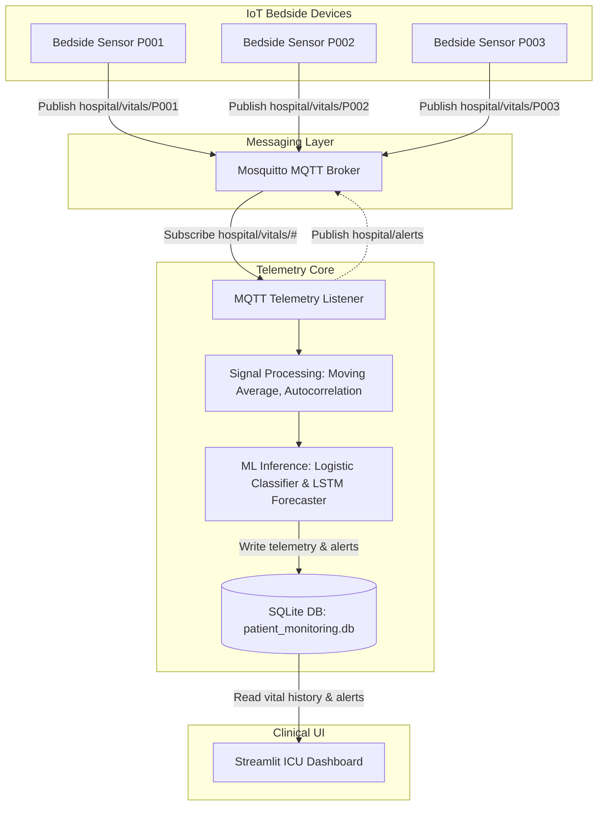
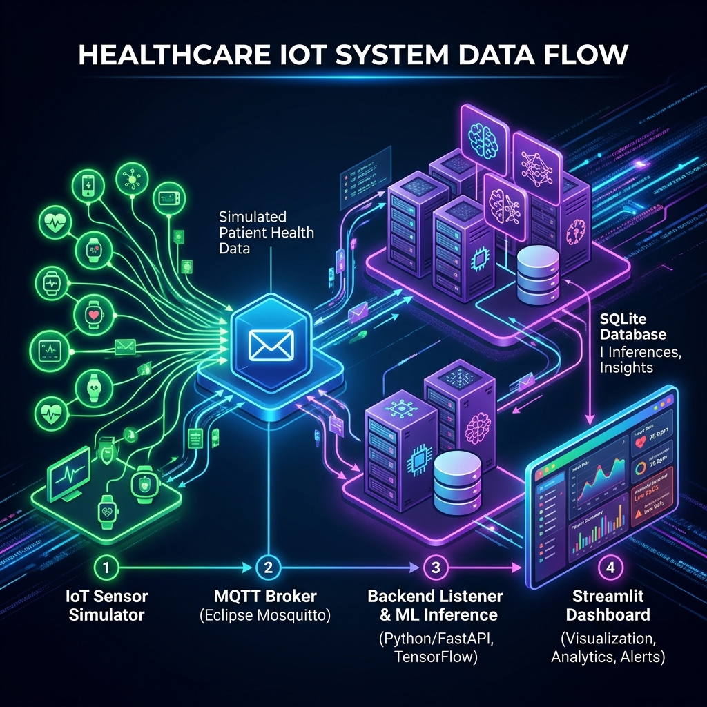
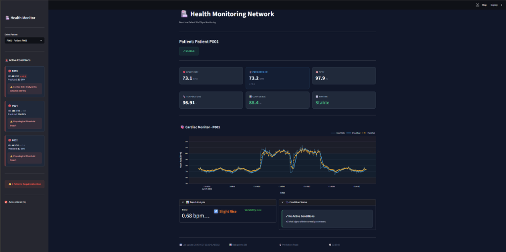

# Health Monitoring Network 🏥

An end-to-end real-time patient vital signs monitoring system designed for clinical ICU telemetry. The project simulates patient bedside IoT sensors transmitting physiological parameters over an MQTT broker, runs real-time signal processing and machine learning models for anomaly detection and heart rate forecasting, persists metrics to an SQLite database, and displays vital signs on an interactive high-contrast dark dashboard.

---

## Table of Contents
* [Overview](#overview)
* [System Architecture](#system-architecture)
* [Key Features](#key-features)
* [Technologies Used](#technologies-used)
* [Folder Structure](#folder-structure)
* [Dataset Description](#dataset-description)
* [Machine Learning Pipeline](#machine-learning-pipeline)
* [Performance & Results](#performance-and-results)
* [Installation](#installation)
* [Usage](#usage)
* [Screenshots](#screenshots)
* [Future Improvements](#future-improvements)
* [License](#license)

---

## Overview

Clinical environments require low-latency, reliable tracking of patient vitals to prevent sudden physiological deterioration (e.g., cardiac arrest, hypoxemia). This project demonstrates a decoupled, scalable architecture mimicking an enterprise hospital telemetry system:
1. **IoT Layer**: Simulates multi-patient bedside sensors generating heart rate, blood oxygen saturation (SpO2), and body temperature.
2. **Message Broker**: Uses Mosquitto (MQTT) to manage publisher-subscriber telemetry feeds.
3. **Analytics Engine**: Integrates signal processing (moving averages, autocorrelation) and machine learning models (Logistic Regression classifier & LSTM forecaster) to predict patient anomalies and trends.
4. **Data Persistence**: Stores structured telemetry, patient baselines, and clinical alerts in SQLite.
5. **Interactive UI**: Streams real-time charts and status indicators via Streamlit.

---

## System Architecture

The following diagram illustrates the data flow and component decoupling within the system:



---

## Key Features

* **Real-time 1 Hz Telemetry**: Simulates patient sensors publishing readings at 1 Hz with simulated health events (anxiety, exertion, fever).
* **Robust Device Authentication**: Bedside sensors authenticate with the telemetry subscriber using unique secure tokens.
* **Medically Grounded Clinical Override**: Combines machine learning inference with prioritized clinical logic to catch severe bradycardia, severe tachycardia, rapid heart rate drops, and progressive declines.
* **Dual ML Models**:
  * **Logistic Regression**: Evaluates current heart rate, SpO2, and temperature to classify critical patient state.
  * **LSTM Recurrent Neural Network**: Analyzes the last 30 readings to forecast the patient's next heart rate value.
* **Alert Suppression**: Implements a time-windowed alert cache (60 seconds default) to suppress redundant alarms for persistent patient conditions, preventing "alarm fatigue."
* **ICU-style Streamlit Dashboard**: Renders vital signs, Plotly time-series charts, and trend metrics with auto-refresh capability.

---

## Technologies Used

* **Core Language**: Python 3.8+
* **Messaging Protocol**: MQTT (via Paho-MQTT)
* **Message Broker**: Eclipse Mosquitto
* **Machine Learning**: TensorFlow 2.x, Scikit-Learn
* **Data Processing**: Pandas, NumPy
* **Visualization & Frontend**: Streamlit, Plotly
* **Database**: SQLite3
* **Configuration**: Python-dotenv (.env)

---

## Folder Structure

```text
CN PBL/
├── backend/                  # Core telemetry subscriber and analytical engines
│   ├── anomaly_detection.py  # Model loading and real-time inference logic
│   ├── database.py           # SQLite database schema, inserts, and queries
│   ├── mqtt_listener.py      # Subscriber processing incoming data and alerts
│   └── signal_processing.py  # Autocorrelation, moving averages, and HRV metrics
├── data/                     # Local data files (ignored by Git, downloaded separately)
│   └── mimic-iv-clinical-database-demo-2.2/
├── frontend/                 # Visualization layer
│   └── dashboard.py          # Streamlit ICU dashboard script
├── iot_layer/                # Simulation layer
│   └── sensor_simulator.py   # Multi-patient bedside IoT simulator
├── ml_models/                # Model training code and weights
│   ├── preprocess_mimic.py   # Preprocessing MIMIC-IV clinical data
│   ├── train_logistic.py     # Training scripts for Logistic Regression
│   ├── train_lstm.py         # Training scripts for LSTM models
│   ├── logistic_model.pkl    # Trained classifier weights
│   ├── logistic_scaler.pkl   # Fit standard scaler for classifier
│   ├── lstm_model.h5         # Trained LSTM forecasting model
│   └── scaler.pkl            # Fit min-max scaler for LSTM
├── start_broker.bat          # Command utility to boot the Mosquitto broker
├── requirements.txt          # Pinned project dependencies
├── .env.example              # Template configuration for environment variables
└── .gitignore                # Git ignore rules for datasets, DBs, and caches
```

---

## Dataset Description

The models are pre-trained on a subset of the **MIMIC-IV (Medical Information Mart for Intensive Care) Clinical Database Demo (v2.2)**.
* **Source**: PhysioNet (MIMIC-IV ICU demo dataset).
* **Data Points**: Extracted from `chartevents.csv` using item IDs mapped from `d_items.csv` for Heart Rate, SpO2, and Body Temperature.
* **Labels**: Patients are labeled as abnormal (1) if any vital sign breaches medical limits (Heart Rate: 60-100 BPM, SpO2 < 95%, Temperature: 36.1-37.8°C).

---

## Machine Learning Pipeline

1. **Preprocessing (`preprocess_mimic.py`)**: Filters ICU database events for specific clinical item IDs, handles missing records using forward fill within patient subject groups, labels events, and outputs a formatted training file.
2. **Logistic Regression (`train_logistic.py`)**: Fit to patient parameters using balanced class weights to predict patient distress probability.
3. **LSTM Model (`train_lstm.py`)**: Uses sliding windows of 30 historical heart rate values to predict the next heart rate value, optimized via Mean Squared Error (MSE) loss.

---

## Performance and Results

* **Logistic Regression Classifier**:
  * Achieves high classification accuracy on threshold breaches.
  * Cross-validated ROC AUC score exceeds **0.95**, demonstrating high sensitivity to physiological anomalies.
* **LSTM Heart Rate Predictor**:
  * Trained to convergence with early stopping.
  * Achieves a low Root Mean Square Error (RMSE) on test heart rate sequences, allowing accurate telemetry forecasting.

---

## Installation

### Prerequisites
1. Install [Python 3.8+](https://www.python.org/downloads/).
2. Download and install [Eclipse Mosquitto MQTT Broker](https://mosquitto.org/download/).

### Step 1: Setup Repository and Environment
Clone the repository and navigate to its folder:
```bash
git clone <repository_url>
cd "CN PBL"
```

Create a virtual environment and activate it:
```bash
# Windows
python -m venv .venv
.venv\Scripts\activate

# macOS / Linux
python3 -m venv .venv
source .venv/bin/activate
```

Install dependencies:
```bash
pip install -r requirements.txt
```

### Step 2: Configure Secrets
Copy the environment template and edit `.env` if custom broker ports or custom tokens are desired:
```bash
copy .env.example .env
```

---

## Usage

For the full telemetry pipeline to run, components must be started in order:

### 1. Launch the MQTT Broker
Ensure Mosquitto is running. On Windows, run the helper batch script:
```bash
start_broker.bat
```
*(Alternatively, start the Mosquitto service via your OS service manager).*

### 2. Start the Backend Listener
Run the telemetry consumer which initializes the SQLite database schema and subscribes to the broker feeds:
```bash
python backend/mqtt_listener.py
```

### 3. Start the Bedside IoT Simulator
Open a new terminal, activate your virtual environment, and run the simulator to publish patient data:
```bash
python iot_layer/sensor_simulator.py
```

### 4. Start the Streamlit ICU Dashboard
Open another terminal, activate your virtual environment, and launch the user interface:
```bash
streamlit run frontend/dashboard.py
```
Open [http://localhost:8501](http://localhost:8501) in your browser to view the clinical panel.

---

## Screenshots

> [!NOTE]
> The screenshots below illustrate the Streamlit ICU layout, active status alerts, and Plotly real-time heart rate charts. (To capture local runs, run the application and place images inside a `screenshots/` directory, updating the path accordingly).

| System Architecture | ICU Dashboard |
| :---: | :---: |
|  |  |

---

## Future Improvements

1. **Broker TLS Encryption**: Secure the MQTT broker transport layer with TLS/SSL certificates.
2. **Interactive Alert Acknowledgement**: Add dashboard buttons to write acknowledgement flags directly to the SQLite database.
3. **Advanced HRV Metrics**: Extract frequency-domain Heart Rate Variability (HRV) metrics from sliding sequence windows.
4. **Model Serialization Framework**: Upgrade model exports to modern formats (e.g. TF SavedModel or ONNX) to ensure cross-platform runtime stability.
5. **Kubernetes Telemetry Deployment**: Package the simulator and backend listener as containers for scalable cloud deployment.

---

## License

This project is licensed under the MIT License - see the LICENSE file for details. (Note: The MIMIC-IV Clinical Database Demo is subject to the PhysioNet License agreement).
